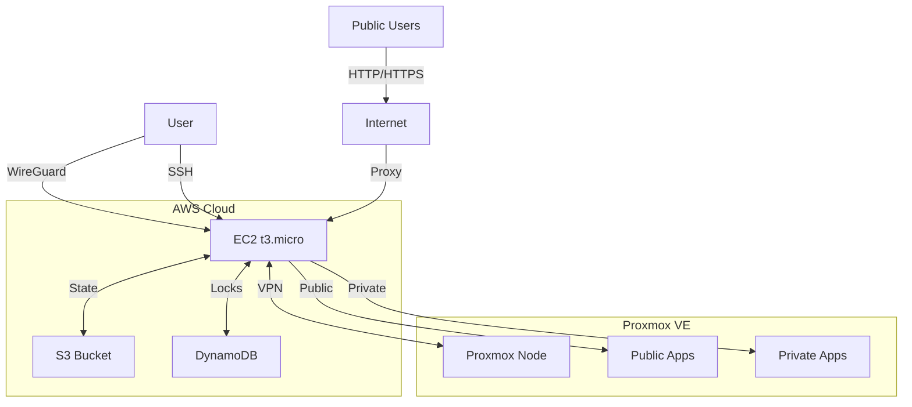
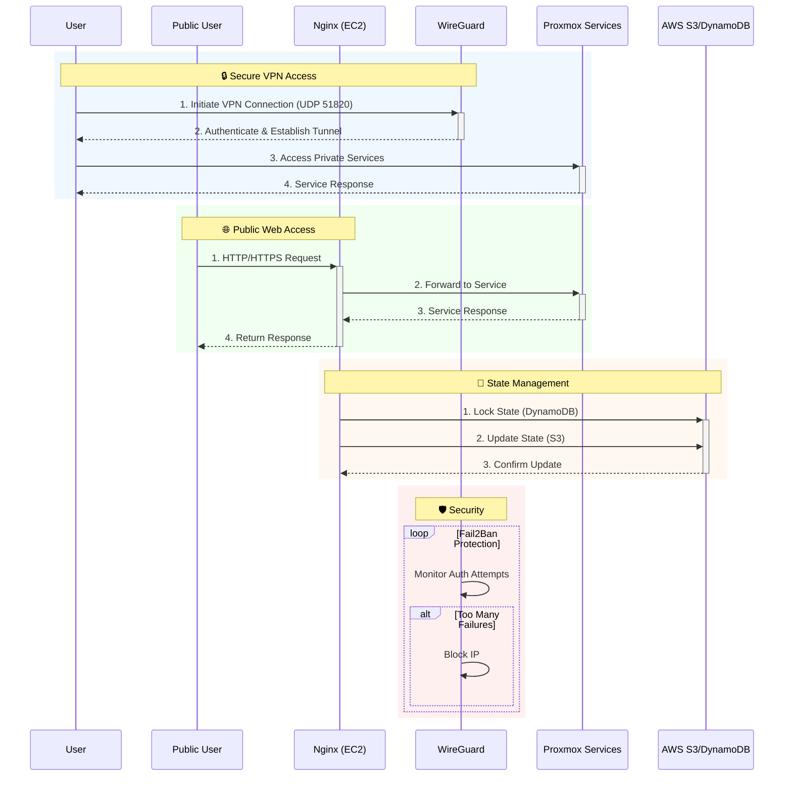
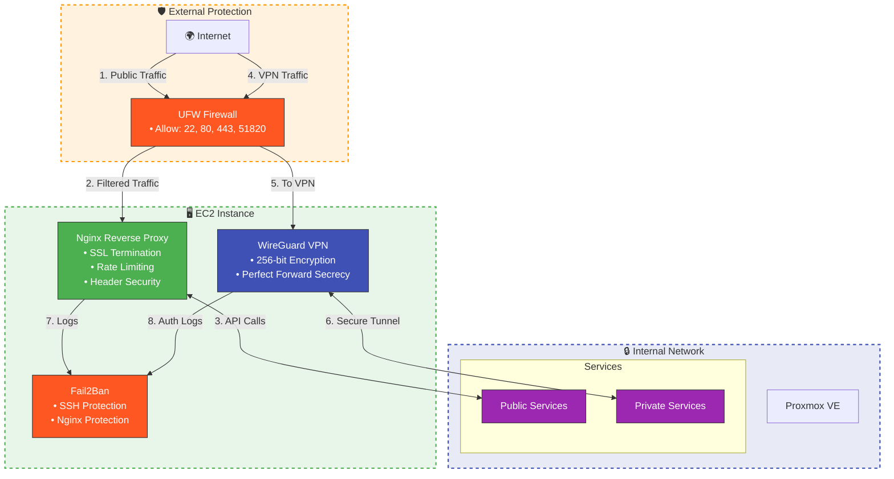

# Proxmox GitOps with WireGuard VPN & Nginx Reverse Proxy

This repository implements a GitOps workflow for managing a Proxmox server with secure remote access via WireGuard VPN. The infrastructure is fully managed using Terraform and Ansible, with GitHub Actions for CI/CD.

## ✨ Features

- **Secure Remote Access**
  - WireGuard VPN server on AWS EC2 instance
  - Key-based SSH access to Proxmox node
  - Fail2Ban protection for both VPN and SSH
  - UFW firewall with strict port rules

- **Public-Facing Services**
  - Nginx reverse proxy on AWS EC2 instance
  - Let's Encrypt SSL certificates
  - Support for both public and private services
  - WebSocket and HTTP/2 support

- **Infrastructure Components**
  - AWS t3.micro EC2 instance for proxy and VPN
  - S3 bucket for Terraform state
  - DynamoDB for state locking
  - Proxmox VE node with LXC containers and VMs

- **Service Architecture**
  - Public applications (web apps, portals)
  - Private services (Plex, management)
  - Separate network zones for security
  - State management with AWS services

- **Security Features**
  - UFW firewall on both AWS and Proxmox
  - Rate limiting on Nginx
  - IP filtering and access control
  - Regular security updates and monitoring

## 📊 Interactive Architecture Diagrams

### 1. System Overview


*Figure 1: Complete system architecture showing all components and their interactions*

### 2. Network Flow Sequence


*Figure 2: Sequence diagram showing network flows for both public and private access*

### 3. Security Architecture


*Figure 3: Security layers and protection mechanisms*

### Diagram Details

1. **System Overview**
   - Shows all major components and their relationships
   - Illustrates data flow between components
   - Highlights AWS and Proxmox environments

2. **Network Flow**
   - Details the sequence of operations for different access patterns
   - Shows secure VPN access flow
   - Illustrates public web traffic handling

3. **Security Architecture**
   - Visualizes defense-in-depth approach
   - Shows security controls at each layer
   - Highlights encryption and access control points

> **Note**: These diagrams are interactive in GitHub's Markdown viewer. Hover over elements to see additional details.

## 🛠 Prerequisites

- **AWS Account**
  - IAM user with programmatic access
  - EC2, S3, and DynamoDB permissions
  - Route 53 access (for DNS management)

- **Proxmox VE**
  - Version 7.0 or later
  - API access enabled
  - API token with appropriate permissions

- **Domain Name**
  - Registered domain (e.g., yourdomain.com)
  - Access to DNS management

- **GitHub**
  - Repository with GitHub Actions enabled
  - GitHub Secrets configured

## 🚀 Quick Start

### 1. Clone the Repository
```bash
git clone https://github.com/yourusername/local-proxmox.git
cd local-proxmox
```

### 2. Configure GitHub Secrets
Add these secrets in your GitHub repository (Settings > Secrets > Actions):

#### AWS Configuration
```
AWS_ACCESS_KEY_ID=your_access_key
AWS_SECRET_ACCESS_KEY=your_secret_key
AWS_REGION=us-east-1
TF_STATE_BUCKET=your-terraform-state-bucket
TF_LOCK_TABLE=terraform-locks
AWS_KEY_NAME=your-key-pair-name
```

#### Proxmox Configuration
```
PROXMOX_API_URL=https://your-proxmox-ip:8006/api2/json
PROXMOX_API_TOKEN_ID=user@pve!token-name
PROXMOX_API_TOKEN_SECRET=your-token-secret
PROXMOX_NODE=your-proxmox-node
SSH_PUBLIC_KEY=your-ssh-public-key
```

### 3. Configure DNS
Point your domain to the EC2 instance's public IP:
```
A    app.yourdomain.com    <EC2_PUBLIC_IP>
A    vpn.yourdomain.com   <EC2_PUBLIC_IP>
CNAME *.yourdomain.com    yourdomain.com
```

### 4. Deploy Infrastructure
1. Push to `main` branch to trigger GitHub Actions
2. Monitor the Actions tab for progress
3. Retrieve WireGuard client config from the EC2 instance:
   ```bash
   cat /etc/wireguard/client.conf
   ```

## Repository Structure

```
.
├── .github/workflows/     # GitHub Actions workflows
│   ├── aws-infra.yml      # Manages AWS infrastructure
│   ├── proxmox-infra.yml  # Manages Proxmox resources
│   └── ansible-deploy.yml # Handles WireGuard configuration
├── ansible/               # Ansible playbooks and roles
│   ├── group_vars/        # Variable files for different environments
│   ├── roles/             # Ansible roles
│   ├── aws-wireguard.yml  # WireGuard server setup
│   └── proxmox-setup.yml  # Proxmox client setup
├── aws/                   # AWS infrastructure as code
│   ├── main.tf            # Main AWS resources
│   ├── variables.tf       # AWS variables
│   └── user-data.sh       # EC2 user data script
├── proxmox/               # Proxmox infrastructure as code
│   ├── main.tf            # Main Proxmox resources
│   └── variables.tf       # Proxmox variables
└── README.md              # This file
```

## 🔧 Configuration

### Nginx Reverse Proxy
Edit `/etc/nginx/sites-available/default` to configure your services:

#### Public Service Example (React App)
```nginx
server {
    listen 80;
    server_name app.yourdomain.com;
    
    location / {
        proxy_pass http://10.10.10.2:3000;
        proxy_http_version 1.1;
        proxy_set_header Upgrade $http_upgrade;
        proxy_set_header Connection 'upgrade';
        proxy_set_header Host $host;
        proxy_cache_bypass $http_upgrade;
    }
}
```

#### Private Service Example (Plex)
```nginx
server {
    listen 80;
    server_name plex.yourdomain.com;
    
    # Only allow from WireGuard network
    allow 10.10.10.0/24;
    deny all;
    
    location / {
        proxy_pass http://10.10.10.2:32400;
        proxy_http_version 1.1;
        proxy_set_header Host $host;
    }
}
```

### Enable HTTPS
Run Certbot to get SSL certificates:
```bash
sudo apt install certbot python3-certbot-nginx
sudo certbot --nginx -d app.yourdomain.com -d vpn.yourdomain.com
```

## 🔒 Security

### Default Firewall Rules
- ✅ Open: 22 (SSH), 80 (HTTP), 443 (HTTPS), 51820 (WireGuard)
- 🔒 All other ports are blocked by default

### Recommended Security Practices
1. **SSH Security**
   - Use SSH keys only (password auth disabled)
   - Change default SSH port (optional)
   - Use fail2ban for brute force protection

2. **WireGuard**
   - Rotate keys periodically
   - Use strong pre-shared keys
   - Limit peer access with AllowedIPs

3. **Nginx**
   - Enable HTTP/2
   - Set strong SSL/TLS settings
   - Implement rate limiting

## 🚨 Troubleshooting

### Common Issues

#### WireGuard Connection Fails
```bash
# Check WireGuard status
sudo wg show

# View logs
journalctl -u wg-quick@wg0 -f
```

#### Nginx Configuration Errors
```bash
# Test Nginx config
sudo nginx -t

# View error logs
sudo tail -f /var/log/nginx/error.log
```

## 📚 Resources

- [WireGuard Documentation](https://www.wireguard.com/)
- [Nginx Documentation](https://nginx.org/en/docs/)
- [Proxmox API Documentation](https://pve.proxmox.com/pve-docs/api-viewer/)
- [Terraform AWS Provider](https://registry.terraform.io/providers/hashicorp/aws/latest/docs)

## 🤝 Contributing

1. Fork the repository
2. Create a feature branch
3. Commit your changes
4. Push to the branch
5. Create a new Pull Request

## 📄 License

This project is licensed under the MIT License - see the [LICENSE](LICENSE) file for details.
